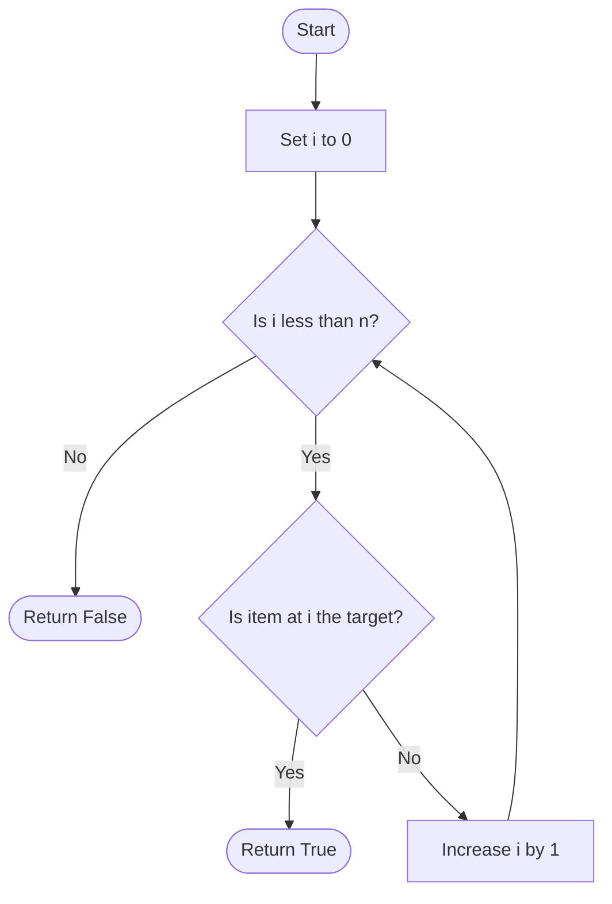
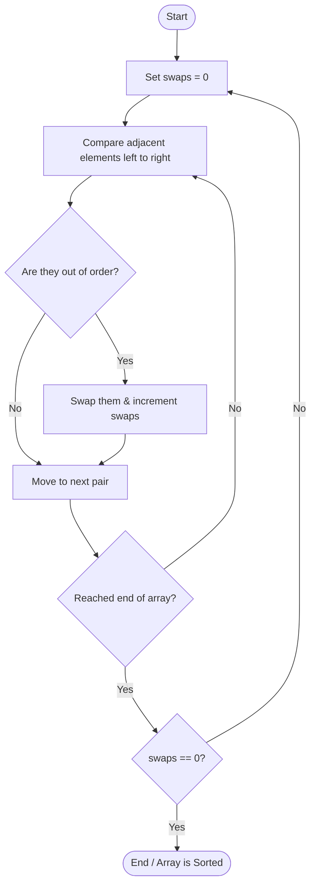
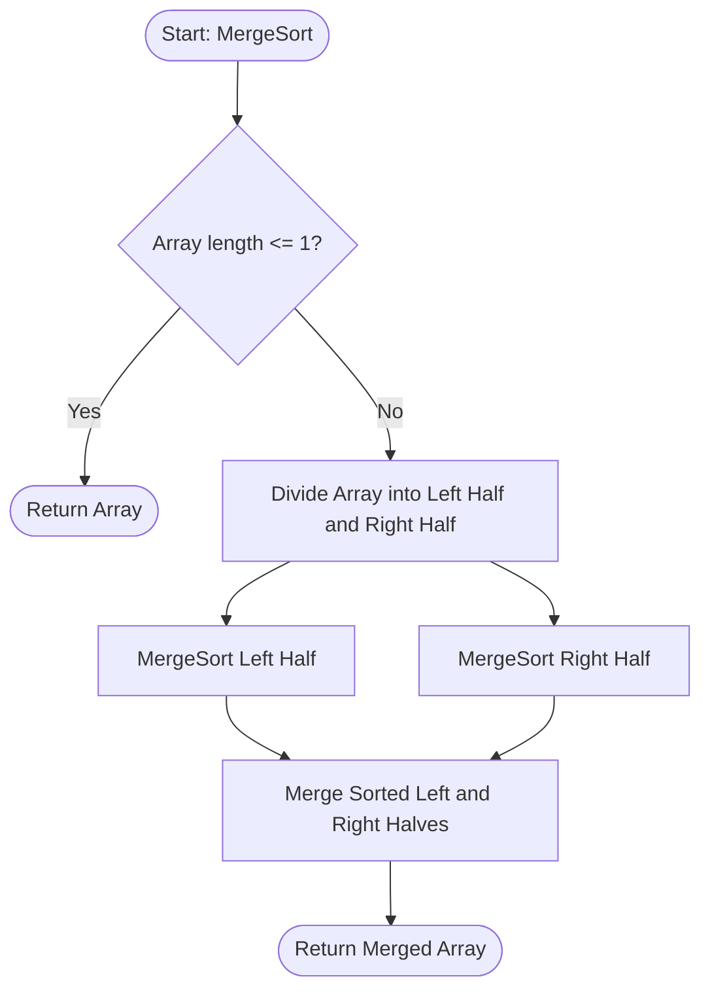

# CS50x 2026 - Lecture 3: Algorithms

**Channel:** CS50 | **Date:** Jan 1, 2026  
**Watch the full lecture here:** [CS50x 2026 - Lecture 3 - Algorithms](https://youtu.be/6Svu_ae5ebk)

## Overview

In this lecture, Professor David J. Malan explores the fundamentals of algorithmic design and problem-solving methodologies. The focus shifts from merely writing "correct" code to designing "efficient" code. We look at foundational searching and sorting algorithms, how to measure an algorithm's performance using asymptotic notation, defining custom data structures in C, and the power of recursion.

---

## Table of Contents

1. [What is an Algorithm?](#what-is-an-algorithm)
2. [Searching Algorithms](#searching-algorithms)
3. [Asymptotic Notation](#asymptotic-notation)
4. [Strings & Structs in C](#strings--structs-in-c)
5. [Sorting Algorithms](#sorting-algorithms)
6. [Recursion](#recursion)
7. [Merge Sort](#merge-sort)

---

## What is an Algorithm?

An algorithm is simply step-by-step instructions for solving a problem. A key goal in computer science is not just to solve a problem but to solve it efficiently.

For instance, counting people in a room one by one is an algorithm, but counting by twos or pairing people up repeatedly (dividing the problem in half) scales much better as the number of people ($n$) grows.

---

## Searching Algorithms

When data is stored in arrays, memory acts like closed lockers. The computer must open them one at a time to check their contents.

### 1. Linear Search

Linear search looks through elements sequentially, from left to right.

- **Pros:** Works on any data, regardless of order.
- **Cons:** Very slow for large datasets.

```c
// Pseudo-code for Linear Search
For i from 0 to n-1
    If number is behind doors[i]
        Return true
Return false
```

#### Linear Search Flowchart

```mermaid
flowchart TD
    A([Start]) --> B[Set i = 0]
    B --> C{i < n?}
    C -- No --> D([Return False])
    C -- Yes --> E{doors[i] == target?}
    E -- Yes --> F([Return True])
    E -- No --> G[i = i + 1]
    G --> C
```

### 2. Binary Search

If the data is already **sorted**, we can start in the middle. If the target is smaller than the middle element, we discard the right half and search the left, repeating this process.

- **Pros:** Extremely fast. Slices the problem in half every step.
- **Cons:** The array _must_ be sorted first.

```c
// Pseudo-code for Binary Search
If no doors left
    Return false
If number is behind middle door
    Return true
Else if number < middle door
    Search left half
Else if number > middle door
    Search right half
```

#### Binary Search Flowchart



---

## Asymptotic Notation

Computer scientists use standard notation to communicate an algorithm's efficiency based on the size of the input, $n$. We ignore lower-order terms and constants because what matters is how the runtime grows as $n$ gets massive.

- **Big $O$ (Upper Bound):** How slow could the algorithm run in the _worst-case_ scenario?
  - Linear Search: $O(n)$
  - Binary Search: $O(\log n)$
- **Big $\Omega$ (Lower Bound):** How fast could the algorithm run in the _best-case_ scenario (e.g., getting lucky on the first try)?
  - Linear/Binary Search: $\Omega(1)$
- **Big $\Theta$ (Exact Bound):** Used when the upper bound $O$ and lower bound $\Omega$ are mathematically the same.

---

## Strings & Structs in C

### String Comparison

You cannot simply use `==` to compare two strings in C. Because strings are arrays of characters, you must compare each character one by one. The `<string.h>` library provides `strcmp()` for this.

- `strcmp(s1, s2) == 0` means the strings are completely identical.

### Data Structures (`struct`)

Arrays are great, but they can only store a single data type continuously. If we want to store a person's name (string) alongside their phone number (string) securely without relying on two decoupled arrays, we can invent a custom data type using `typedef struct`.

```c
typedef struct
{
    string name;
    string number;
}
person;

// Now we can declare an array of 'person'
person people[3];
people[0].name = "Kelly";
people[0].number = "+1-617-495-1000";
```

---

## Sorting Algorithms

Sorting unsorted data (e.g., `7 2 5 4 1 6 0 3` to `0 1 2 3 4 5 6 7`) makes it possible to use fast search methods like Binary Search.

### 1. Selection Sort

Find the smallest number and swap it with the first element. Find the next smallest and swap it with the second, and so on.

- **Running Time:** $O(n^2)$. Even if the list is completely sorted, this algorithm still blindly iterates through everything: $\Omega(n^2)$ and $\Theta(n^2)$.

#### Selection Sort Flowchart

```mermaid
flowchart TD
    A([Start]) --> B[Set i = 0]
    B --> C{i < n - 1?}
    C -- No --> D([End / Array is Sorted])
    C -- Yes --> E[Find smallest element in array from i to n-1]
    E --> F[Swap smallest element with array[i]]
    F --> G[i = i + 1]
    G --> C
```

### 2. Bubble Sort

Move left to right, comparing adjacent pairs and swapping them if they are out of order. The heaviest elements "bubble" up to the end.

- **Running Time:** $O(n^2)$. However, if we add an optimization to stop the loop early if 0 swaps were made during a pass, the best case becomes $\Omega(n)$ (if the list is already sorted).

#### Bubble Sort Flowchart



---

## Recursion

Recursion is a technique where a function is defined in terms of itself—meaning the function _calls itself_ inside its own code.

For a recursive function to not loop infinitely, it requires:

1.  **A Base Case:** The condition at which the function stops (e.g., `if (height <= 0) return;`).
2.  **A Recursive Case:** Calling the same function, but passing it a _smaller_ version of the original problem.

**Example:** Printing a Mario pyramid of height 4 is really just printing a pyramid of height 3, plus one more row.

---

## Merge Sort

Merge Sort uses recursion to sort an array significantly faster than Bubble or Selection sort. It divides and conquers the array by breaking it down to individual elements, and then mathematically merging them back together in order.

1.  Sort the left half.
2.  Sort the right half.
3.  Merge the two sorted halves.

Because it continuously divides the problem in half ($\log n$ levels) and merging takes $n$ steps per level, Merge Sort is much more efficient.

- **Running Time:** $O(n \log n)$, $\Omega(n \log n)$, $\Theta(n \log n)$.
- **Tradeoff:** While blazing fast, it requires more memory (space) to store the merged arrays than in-place algorithms like Selection Sort.

#### Merge Sort Flowchart


